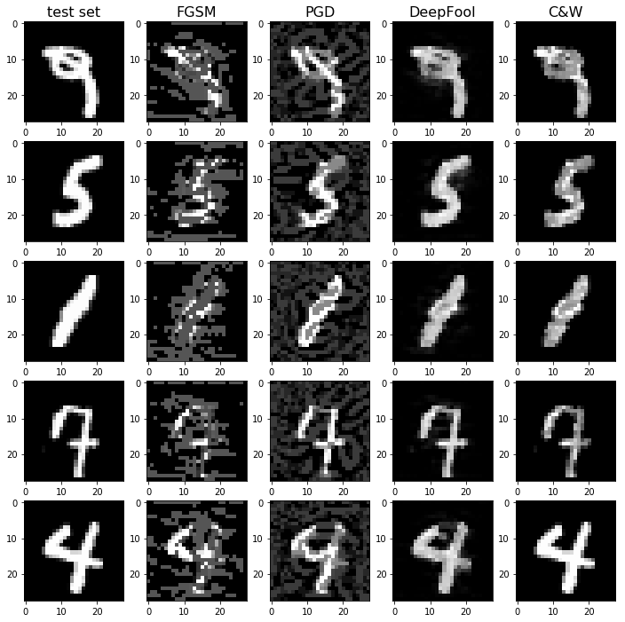
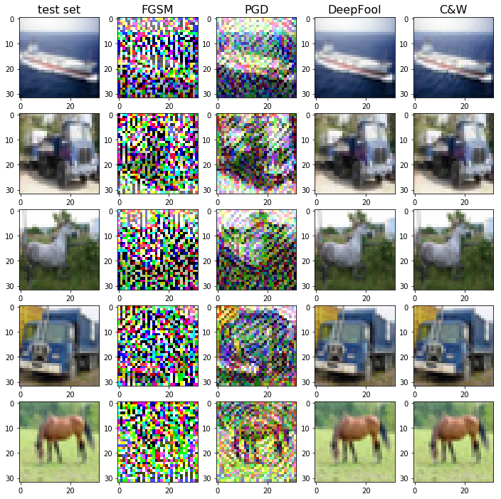

## Adversarial Robustness

### Description
Adversarial examples are special inputs to deep learning models, maliciously crafted to fool them into incorrect outputs. 
Even the state-of-the-art models are vulnerable to adversarial attacks, thus a lot of issues arise in many security fields 
of artificial intelligence.
In this repo we aim at investigating techniques for training adversarially robust models.

Examples of adversarial perturbations:

 

### Repo structure

- `data/` training data and adversarial perturbations
- `notebooks/` 
- `results/` collected results and plots
    - `images/`
- `src/` implementations
    - `RandomProjections/` methods based on random projections
    - `BayesianSGD/` implementation of Bayesian SGD from Blei et al. (2017)
- `trained_models/`
    - `baseline/`
    - `randens/`
    - `randreg/`
- `tensorboard/`
