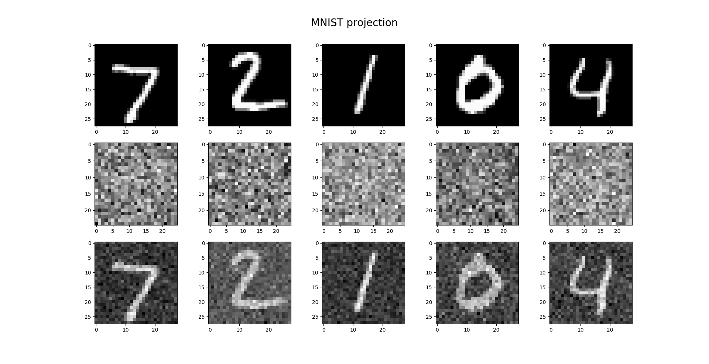
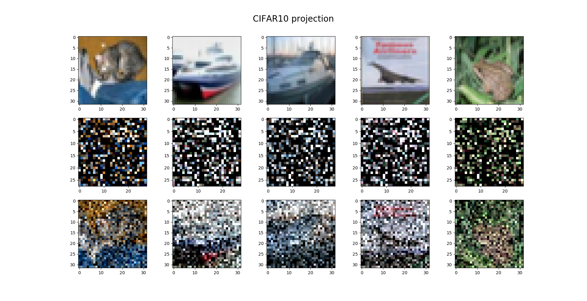
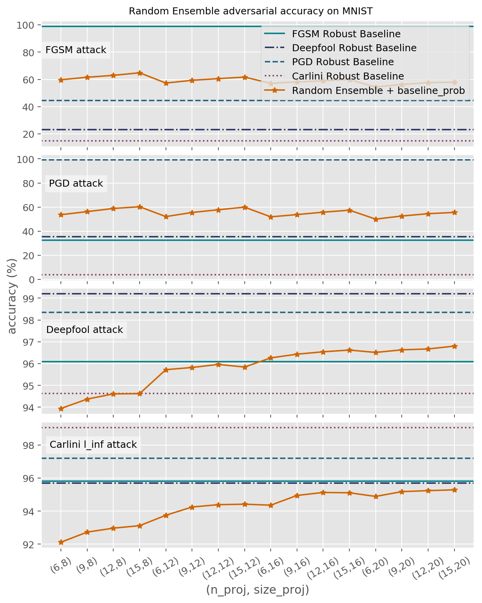
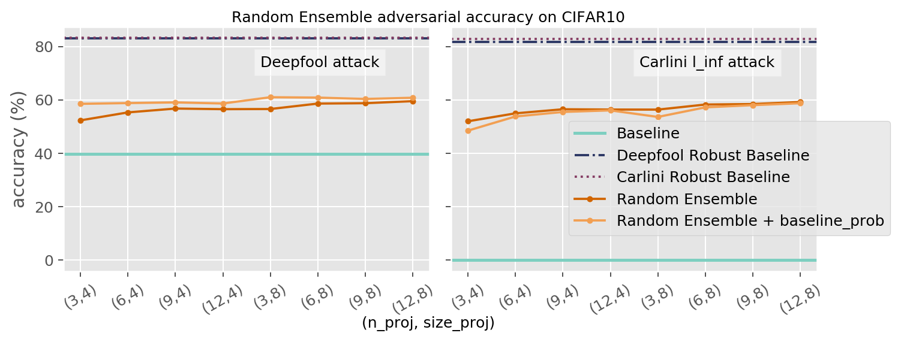
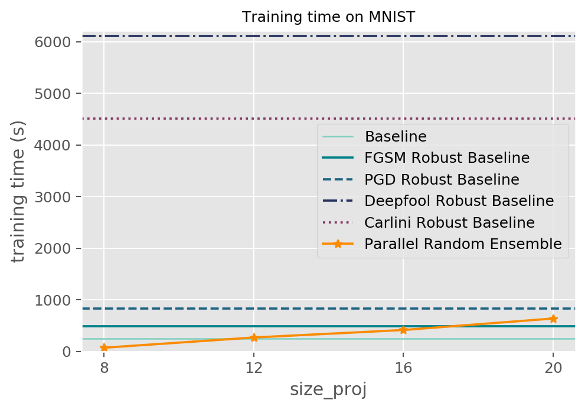
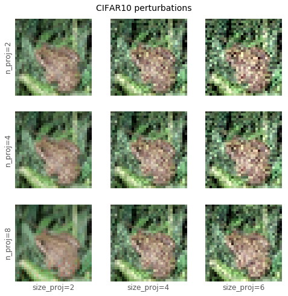
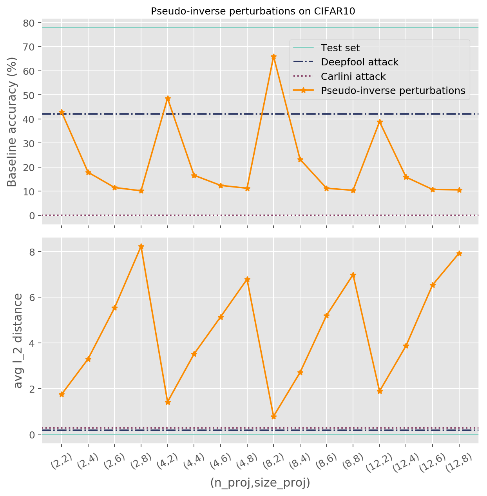

## Adversarially Robust Training using Random Projections
### Description
Adversarial examples are special inputs to deep learning models, maliciously crafted to fool them into incorrect outputs. 
Even the state-of-the-art models are vulnerable to adversarial attacks, thus a lot of issues arise in many security fields 
of artificial intelligence.

Focusing on image classification tasks, we use an intuition behind random projections of the inputs as a defence and we 
propose a training technique, called **Random Projections Ensemble**, which improves the robustness to adversarial examples
 of any given classifier. This method projects the input data in multiple lower dimensional spaces, each one corresponding 
 to a random selection of directions in the space. Then it trains a new classifier in each subspace, using the corresponding 
 projected version of the data. Finally, it performs an ensemble classification on the original high dimensional data. 
Then we propose a regularization method for training an adversarially robust classifier, called **Random Projections 
Regularizer**. Both methods are meant to be attack independent.

We evaluate adversarial vulnerability of the resulting trained models and compare them to robust models given by
adversarial training technique. 
We compare the ensemble method to the regularization method in terms of performances and computational efficiency. 
Scalability and parallelizability .

### Main results and plots

Adversarial perturbations

 

Inverse projections

 

Adversarial robustness

 

Computational complexity

 

Perturbed images
 

### Implementation overview

**Libraries** used: `Tensorflow`, `Keras` and IBM `adversarial-robustness-toolbox`.

**Machine specs**: 34 single core Intel(R) Xeon(R) Gold 6140 CPU @ 2.30GHz processors, 200GB of RAM.

**Models**:
- the baseline for our tests is `baseline_convnet`, a basic CNN trained on mnist.
- `random_ensemble` computes `n_proj` random projections of the training data in a lower dimensional space 
(whose dimension is `size_proj`^2), then classifies the original high dimensional data with a voting technique on the 
single classifications.
- `random_regularizer` is a regularization method based on the computation of loss gradients over input data 
projections.

### Folders structure

- data
- notebooks
- results
    - images
- src
- trained_models
    - baseline
    - random_ensemble
    - random_regularizer
