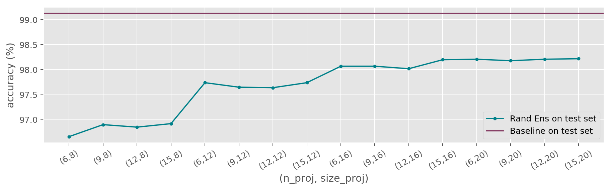
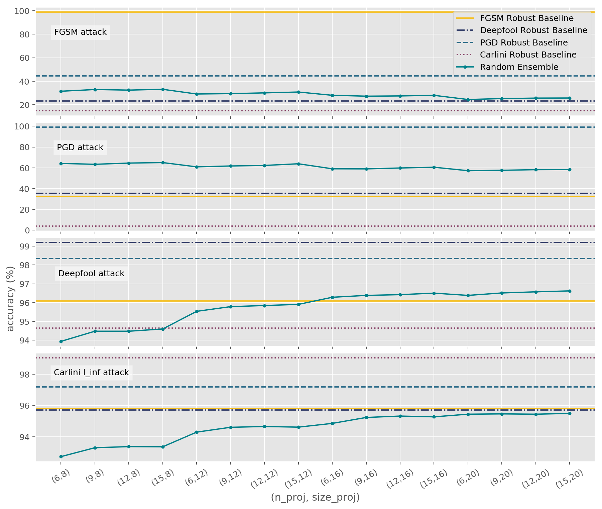

## Adversarially Robust Training using Random Projections
### Master thesis project 

Implementations of robust classifiers in the context of adversarial examples.
The proposed methods are based on the computation of random projections and the use of `Keras` and 
IBM `adversarial-robustness-toolbox`.

Models:
- The baseline for our tests is `baseline_convnet`, a basic CNN trained on mnist.
- The model `random_ensemble` computes `n_proj` random projections of the training data in a lower dimensional space 
(whose dimension is `size_proj`^2), then classifies the original high dimensional data with a voting technique on the 
single classifications.

### Current results

### Folders structure

- data
- notebooks
- results
- src
- trained_models
    - baseline
    - IBM-art
    - random_ensemble
